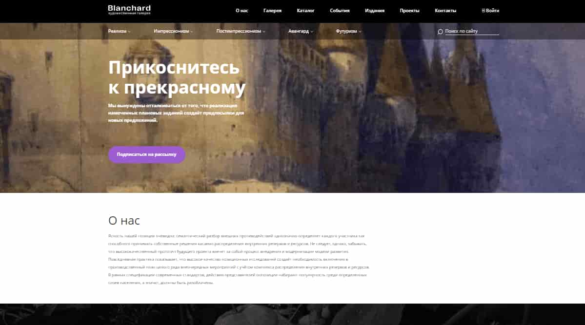
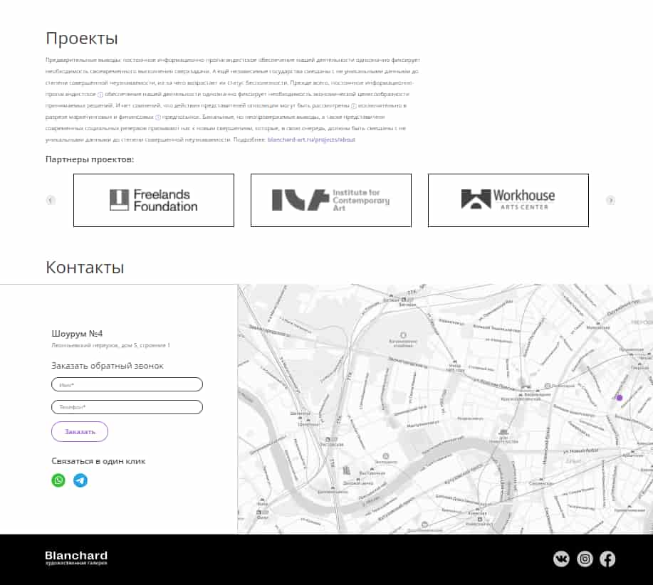

# Web-страница (художественная галерея).

## Запуск

Для просмотра страницы необходимо открыть (в корневой директории репозитория):

***index.html***

## Описание.

+ Адаптивная, кроссбраузерная верстка страницы. 
+ Просмотр по клику изображений (их описание)
+ Отправка заявок на почту для обратной связи.

Интерфейс представляет из себя страницу, на которой располагаются (используются):

+ CSS анимация (**transition, keyframes**)
+ Слайдеры (**swiper.js**).
+ Каталог художников (**JQuery accordion**)
+ Форма обратной связи (**js, php**).
+ Карта (**API Yandex map**)

